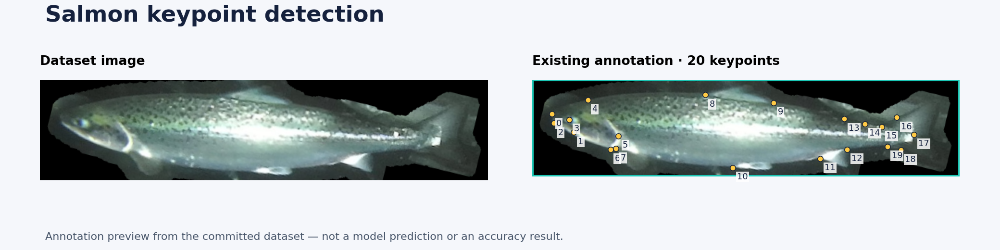

# Salmon Keypoint Detection and Geometric Analysis

Detecting a fish is only the first step. This project explores **20 anatomical keypoints** on salmon and uses their geometry to investigate body shape and possible deformities.



*The preview shows existing dataset annotations, not model predictions. Keypoint numbers are zero-based indices. No new detection accuracy is claimed.*

[Research walkthrough](docs/research-walkthrough.md) · [Dataset checks](scripts/validate_dataset.py) · [Training helper](scripts/train.py)

## What is in the repository

The research notebook uses Ultralytics YOLOv8 pose estimation. The geometric-analysis scripts calculate distances, slopes and ratios from keypoints and compare measurements with baseline CSV data.

| Component | Start here |
| --- | --- |
| Training and inference exploration | `Yolo_for_keypoint_detection.ipynb` |
| Dataset and 20-point label format | `data/` and `config.yaml` |
| Geometry and baseline comparisons | `Geomtircal analysis/` |
| Pairing and annotation checks | `scripts/validate_dataset.py` |
| Reproducible annotation preview | `scripts/preview_annotations.py` |

## Inspect it without training

With Python 3 installed:

```bash
python scripts/validate_dataset.py
python -m unittest discover -s tests -v
python -m pip install -r requirements-preview.txt
python scripts/preview_annotations.py
```

The first two commands require only the Python standard library. The preview recreates the image at the top of this README from the committed data.

## Dataset organisation

There are **400 training images and 59 validation images**, with matching labels under `labels/train` and `labels/val`. Each object row contains a class, a bounding box and 20 `(x, y, visibility)` triplets. Coordinates are normalised to image size.

The original export also contains 68 files under `labels/test`. The 59 exact filename matches for validation images have been copied into the expected `labels/val` directory without changing annotation content. Nine remaining exports have no corresponding validation image here. The original export is preserved; it is not presented as a complete independent test set.

Filename separation alone does not establish statistical independence. Images may come from related recordings; a reliable evaluation must address recording-level and fish-level leakage.

## Train and predict

```bash
python -m pip install -r requirements.txt
python scripts/train.py --epochs 50 --device cpu
# Use --device 0 for a suitable CUDA setup.
python scripts/predict.py --weights runs/salmon-pose/weights/best.pt --source data/images/val
```

The training helper resolves the dataset path locally. The first run may download pretrained YOLOv8 weights. Horizontal and vertical flips are disabled until the anatomical point permutation is verified. Existing run directories can cause Ultralytics to choose a numbered run name; use the weights path printed by your run.

The original notebook recorded Ultralytics 8.0.203. The new helpers follow the documented Ultralytics interface, but a full training run has not been repeated with a pinned environment. Save the package versions, seed, model and split for any result you report.

## Evaluation and limitations

Trained salmon weights and a verified held-out metrics report are not included. Dataset-format checks are not model-quality tests. Before making a deformity-detection claim, report keypoint localisation error, the geometric decision rule, false positives, failure cases and evaluation on independent examples. The exploratory geometry scripts still contain manually selected examples and external CSV references.

The historical `config .yaml` is retained for reference; new commands use `config.yaml`. The upstream model code and image data may have separate reuse conditions; this README does not grant new rights to either.

References: [Ultralytics pose estimation](https://docs.ultralytics.com/tasks/pose/) · [YOLO pose dataset format](https://docs.ultralytics.com/datasets/pose/).
